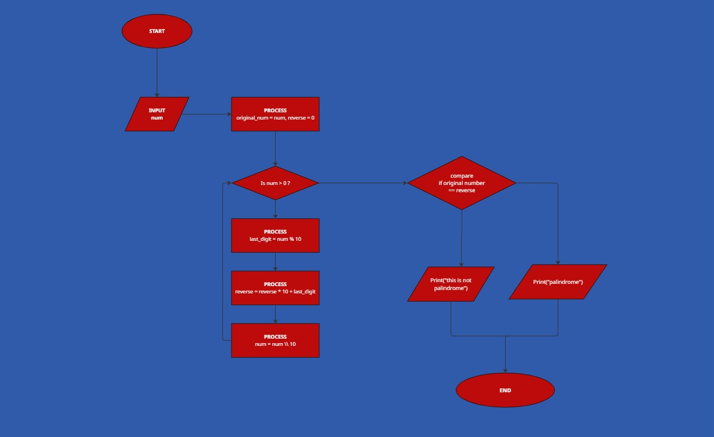

## Palindrome Process Explanation

So basically, what we’re trying to do is check if a number is a palindrome. A palindrome is just a number that looks the same when you reverse it, like 121 or 1331.

First, the program asks the user to enter a number. That number is stored in a variable, and we also keep a copy of it as the original value so we can compare it later.
 Next, we create another variable called reverse and set it to 0. This is what we’ll use to build the reversed version of the number.
 After that, the program enters a loop that keeps running as long as the number is greater than 0. Inside the loop, we take the last digit of the number using the modulus operation (number mod 10). Then we add that digit to reverse, but before adding it, we multiply reverse by 10 so the digits shift to the left.

Once we’ve taken the last digit, we remove it from the number using integer division (number ÷ 10). This way, we keep reducing the number digit by digit.
This process continues until the number becomes 0, meaning all digits have been processed and the reversed number is complete.

Finally, we compare the reversed number with the original number we saved earlier. If they are the same, then the number is a palindrome. If not, then it isn’t.
