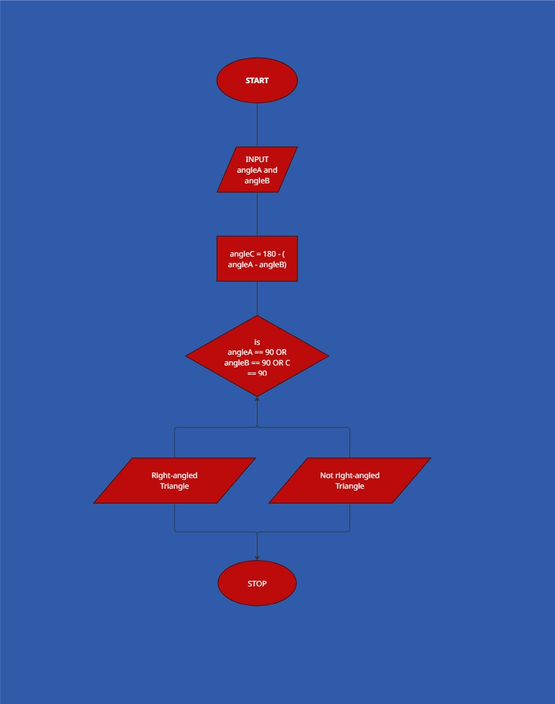

## Right-Angled Triangle Process Explanation

So what we’re trying to do here is check whether a triangle is right-angled or not. A right-angled triangle is any triangle that has one angle equal to 90 degrees.

First, the program asks the user to input two angles of the triangle. These values are stored in variables angleA and angleB.

Next, since we know that the sum of all angles in a triangle is 180 degrees, we calculate the third angle by subtracting the sum of the first two angles from 180. This gives us:

angleC = 180 - (angleA + angleB)

After calculating the third angle, the program checks if any of the three angles is equal to 90 degrees. It does this using a conditional statement with the OR operator, meaning only one of the angles needs to be 90 for the condition to be true.

If any of the angles is 90 degrees, the program prints that the triangle is a right-angled triangle. If none of the angles is 90 degrees, it prints that the triangle is not right-angled.

